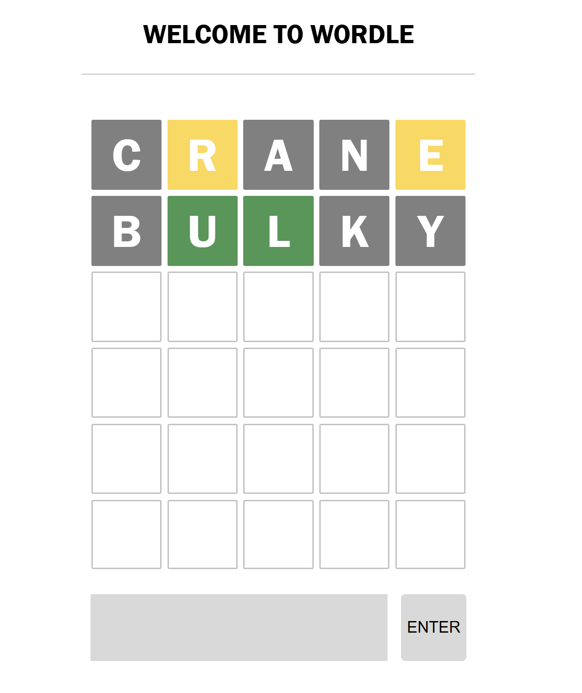

# Wordle

## Game Information

**Name:** Wordle  
  
**Description:**  
A recreation of the popular *New York Times* game **Wordle**. Players are given 6 guesses to find the secret 5-letter word.

**Background:**  
I chose to make Wordle because I've been a big fan of the game. My friends and I have been playing it together for the past half-year and always compete to see who can solve the puzzle in the fewest guesses. I thought it would be fun to recreate the game using my newly learned coding skills.

---

## Getting Started

**Play the game:**  
[Wordle Live Demo](https://tracywlan.github.io/wordle/)

**View planning materials:**  
[Project Planning Document](https://github.com/TracywLan/wordle/blob/main/Browser-based-game-planning.md)

---

## Technologies Used

- JavaScript  
- HTML  
- CSS

---

## Attributions

**Word Sources:**  
- [Wordle Words (MrJanHorak)](https://github.com/MrJanHorak/wordle-solution-helper/blob/main/src/data/wordle-words.json)  
- [Wordle Dictionary (Slushman)](https://gist.githubusercontent.com/slushman/e112816f2894aecf013da881130e7805/raw/7fa83100c9235edc5edad5aef6e5b85dc1fdeb02/wordle-dictionary)

**External References:**  
- [GitHub Actions – Create a JavaScript Action](https://docs.github.com/en/actions/tutorials/create-actions/create-a-javascript-action)  
- [MDN Web Docs](https://developer.mozilla.org/en-US/)

---

## Next Steps

- Display letters that have been used in the puzzle  
- Allow input directly into boxes (like the real Wordle game)  
- Add an on-screen keyboard  
- add tile flip animation
- add animation delay

---

*Created by [Tracy Lan](https://github.com/TracywLan)*
